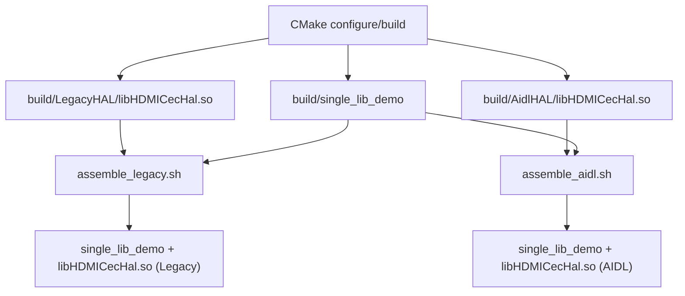

# HDMI CEC HAL Assemble-One-Lib Demo

This folder demonstrates how to build one executable and package it with either
the Legacy or AIDL HDMI CEC HAL shared library.

## Description

The CMake build creates:

- `build/single_lib_demo`
- `build/LegacyHAL/libHDMICecHal.so`
- `build/AidlHAL/libHDMICecHal.so`

Both HAL variants are built with the same output file name (`libHDMICecHal.so`),
but are generated in different directories. This lets packaging choose which
implementation to deploy by selecting the corresponding `.so`.

## Pros

- Single executable artifact (`single_lib_demo`) for both HAL variants.
- Fast packaging switch between Legacy and AIDL implementations.
- Same library name simplifies deployment contract for consumers.
- Easy to validate each packaging path using dedicated assemble scripts.

## Cons

- Both HAL variants are compiled even if only one is used on target.
- Shared library name is identical, so wrong-copy mistakes are easy.

## Architecture

### Source Layout

```
assemble_one_lib/
├── CMakeLists.txt
├── HDMICecHal.h
├── main.cpp
├── LegacyHAL/
│   └── HDMICecHal.cpp
├── AidlHAL/
│   └── HDMICecHal.cpp
├── assemble_legacy.sh
└── assemble_aidl.sh
```

### Build/Packaging Flow



## Prerequisites

- CMake 3.14 or newer
- C++17-capable compiler (GCC or Clang)

## Build Instructions

Run from `assemble_one_lib`:

```bash
cmake -S . -B build
cmake --build build -j
```

## Assemble Instructions

### Assemble Legacy Package

```bash
./assemble_legacy.sh
```

Creates:

- `out/single_lib_demo`
- `out/libHDMICecHal.so` (from `build/LegacyHAL`)

### Assemble AIDL Package

```bash
./assemble_aidl.sh
```

Creates:

- `out/single_lib_demo`
- `out/libHDMICecHal.so` (from `build/AidlHAL`)

Note: each assemble script recreates `out`, so run one at a time depending on
which HAL variant you want to package.

### Execute from assembled out directory

```bash
LD_LIBRARY_PATH=./out ./out/single_lib_demo
```

`LD_LIBRARY_PATH` is required so the loader can find `out/libHDMICecHal.so`.

## Clean

```bash
rm -rf build out
```
