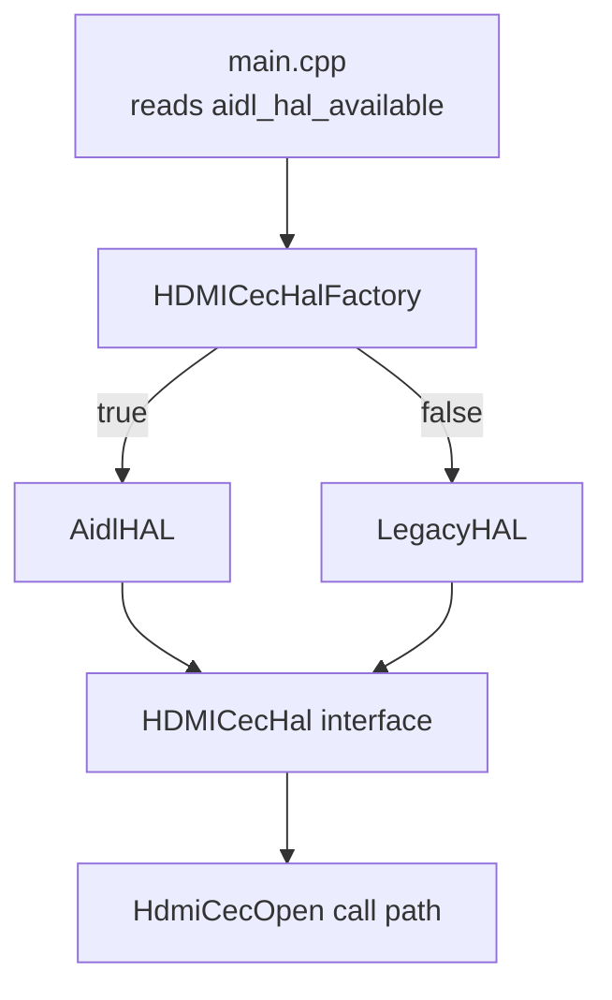

# HDMI CEC HAL Factory Demo

A C++ example demonstrating the **Factory Pattern** for selecting a HAL implementation at runtime.

### Description

`HDMICecHalFactory` returns either an `AidlHAL` or a `LegacyHAL` instance depending on the `aidl_hal_available` flag.

Availability of AIDL HAL (`aidl_hal_available`) can identified from the systemd unit file.

### Pros

- Decouples client code (`main.cpp`) from concrete HAL implementations.
- Keeps object creation in one place (`HDMICecHalFactory`).
- Makes it easier to add new HAL backends with minimal client-side changes.
- Improves testability by switching implementations via a single decision point.
- Encapsulates runtime selection logic cleanly.

### Cons

- Keeps the other implmentation unnecessarily, because both HAL won't coexist in same device.
- Increases rootfs size and memory consumption.
- Wrong defaults in factory selection can lead to subtle runtime behavior issues.

## Project Structure

```
factory/
├── CMakeLists.txt
├── HDMICecHal.h            # Abstract base class
├── AidlHAL.h / AidlHAL.cpp # AIDL-based HAL implementation
├── LegacyHAL.h / LegacyHAL.cpp       # Virtual HAL implementation
├── HDMICecHalFactory.h / HDMICecHalFactory.cpp  # Factory
└── main.cpp                # Entry point
```

## Architecture Diagram



## Prerequisites

- CMake >= 3.14
- A C++17-capable compiler (GCC, Clang, etc.)

## Build

```bash
cmake -S . -B build
cmake --build build -j
```

The binary is produced at `build/factory_demo`.

## Run

Pass `1` (or `true` / `yes`) to use `AidlHAL`, or `0` (or `false` / `no`) to use `LegacyHAL`.

```bash
# Use AidlHAL
./build/factory_demo 1

# Use LegacyHAL
./build/factory_demo 0
```

The flag can also be supplied via an environment variable when no argument is given:

```bash
aidl_hal_available=true  ./build/factory_demo
aidl_hal_available=false ./build/factory_demo
```

If neither an argument nor the environment variable is set, `LegacyHAL` is used by default.

## Expected Output

```
# ./build/factory_demo 1
AidlHAL::HdmiCecOpen invoked

# ./build/factory_demo 0
LegacyHAL::HdmiCecOpen invoked
```

## Clean

```bash
rm -rf build
```
